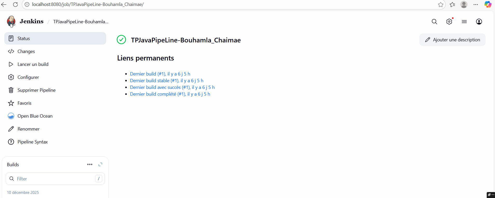
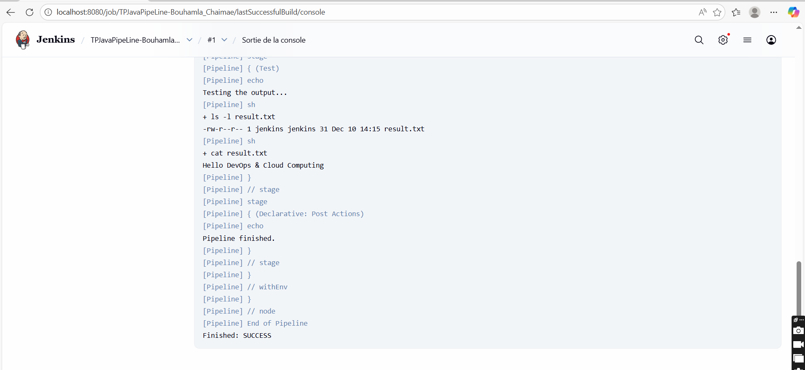

# TP DevOps : Pipeline Java avec Jenkins

Auteur : Chaimae Bouhamla
Projet : Création d'un pipeline CI/CD automatisé pour une application Java.

## Description du projet
Ce projet consiste à automatiser le cycle de vie d'une application Java simple en utilisant Jenkins et Docker. Le pipeline est défini via un fichier `Jenkinsfile` (Pipeline as Code) et comprend les étapes suivantes :

1.  Build : Compilation du code source Java (`javac`).
2.  Run : Exécution du programme compilé.
3.  Test : Vérification de la présence des fichiers résultats.

## Preuves d'exécution

### 1. Statut du Pipeline
Le pipeline s'est exécuté avec succès, déclenché automatiquement depuis le dépôt GitHub :

### 2. Résultat de la console
Voici la trace d'exécution prouvant que le code Java a bien affiché le message attendu :

Le message "Hello DevOps & Cloud Computing" s'affiche correctement.